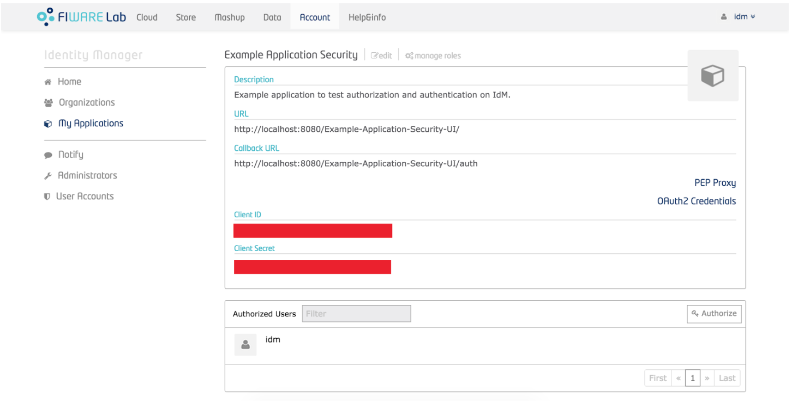

*************************************
Tutorial para Aplicações com Fiware 
*************************************

.. contents::
   :local:
   :depth: 3

.. _autores:

Autores
=======

- Irene Ginani Costa Pinheiro
- Carlos Eduardo da Silva
- Gabriela Cavalcante da Silva
    
Introdução
===============
    
Sabemos que é altamente desejado que informações, aplicativos, ou softwares sejam acessados somente por aqueles autorizados para tal. Para isso, existem vários mecanismos que lidam com diferentes aspectos de segurança da informação, tais como autenticação, políticas de segurança, entre outros. 

A plataforma `FIWARE <https://www.fiware.org/>`_ foi projetada para considerar estes aspectos em uma abordagem secure by design, onde atributos de segurança da plataforma em si, e das aplicações que executem sobre ela, são considerados através de uma arquitetura de segurança que engloba questões relacionadas a gestão de identidades, controle de acesso e monitoramento de eventos de segurança. Isso é conseguido com um conjunto de Generic  Enablers (GEs) que podem ser integrados com outros GEs da plataforma. Dessa forma, utilizaremos as seguintes GE's

O Identity Management GE (IdM) é responsável pelo gerenciamento de identidades de usuários, organizações e aplicações, assim como de suas respectivas credenciais, e da autenticação dessas entidades, além do suporte para a forma centralizada é importante lembrar que o FIWARE também dá suporte para auntenticação federada.. Este GE considera requisitos para a gestão de identidades de “coisas” (IoT), e atende às especificações para o gerenciamento de identidades sobre diferentes domínios. Ele também oferece uma API REST para o gerenciamento de identidades em ambientes multi-tenant, permitindo ainda a gestão de autorização, com suporte a definição de papéis e permissões específicas de uma organização ou de uma aplicação. Desenvolvedores interagem com este componente para registrarem suas aplicações no IdM, e para gerenciar a segurança de suas aplicações (credenciais, papéis e políticas de autorização). Usuário finais usam o IdM GE para se registrarem, e gerenciar seus respectivos perfis e suas organizações, enquanto que todas as entidades clientes de aplicações utilizam o IdM para fins de autenticação. A implementação de referência deste GE é o Keyrock. 

O Authorization PDP GE (PDP) é o componente responsável por gerenciar políticas de autorização na plataforma FIWARE. Este componente utiliza a linguagem XACML para representação de políticas, implementando a especificação XACML Core v3.0.  As políticas definidas pelos desenvolvedores por meio do IdM são gerenciadas pelo PDP, que é responsável também por avaliar requisições de acesso, encaminhadas pelo PEP, para permitir ou negar o acesso a serviços. A implementação de referência deste GE é o AuthZForce.

O PEP Proxy GE (PEP) atua como ponto de aplicação de políticas de segurança na forma de um proxy-reverso HTTP, com o objetivo de proteger serviços REST. Este componente intercepta as requisições para o serviço, interage com o IdM para autenticar a requisição e o token da entidade cliente anexado à requisição, e em seguida interage com o PDP que autoriza ou não o acesso ao serviço. Além de validar o token e a requisição por meio do IdM, o PEP também recupera informações sobre o token, e seu usuário, deste mesmo componente. Para tomar uma decisão de acesso, o PDP leva em consideração a política de segurança definida, informações acerca da requisição do cliente, e informações acerca do token enviado (tais como atributos do cliente obtidos do IdM). O PEP aplica a decisão do PDP, e em caso positivo, encaminha a requisição ao serviço, e a resposta do serviço ao cliente. A implementação de referência para este GE é o Wilma. A plataforma FIWARE suporta a utilização de outros PEPs, como por exemplo PEPs que protejam serviços não-REST ou serviços que utilizem outros protocolos além de HTTP.

Neste contexto, esse tutorial tem como objetivo ensinar aos usuários como conceber aplicações seguras utilizando conceitos autenticação e autorização através do uso das GE's de segurança da plataforma FIWARE. 

    
Instalação do ambiente
=======================

Agora iremos aprender a instalar o ambiente que você utilizará em sua aplicação

Instalando o back-end: Docker (Infraestura com GE's FIWARE)
-----------------------------------------------------------

Antes de colocar a infra em execução é necessário realizar algumas instalações:

- Para a instalação do docker siga o tutorial disponível em: `Instalação do Docker <https://www.digitalocean.com/community/tutorials/como-instalar-e-usar-o-docker-no-ubuntu-16-04-pt>`_

- Para instalação do docker-compose siga o tutorial disponível em: `Instalação do docker-compose <https://www.digitalocean.com/community/tutorials/how-to-install-docker-compose-on-ubuntu-16-04>`_

- Para instalação do docker-machine siga o tutorial disponível em: `Instalação do docker-machine <https://www.digitalocean.com/community/tutorials/how-to-provision-and-manage-remote-docker-hosts-with-docker-machine-on-ubuntu-16-04>`_

Após a instalação é necessário fazer clone ou download deste repositório:

- Faça clone deste repositório: `keyrock-tutorial <https://github.com/FIoT-Client/keyrock-tutorial>`_

Configuração do ambiente virtual para o back-end
-------------------------------------------------

Após efetuar os passos da instalação é necessário configurar o ambiente para que possamos executar a infraestrutura necessária.

- No arquivo keyrock-tutorial/keyrock/files/local_settings.py altere o valor do atributo na linha 629, onde consta.::
				
	ACCESS_CONTROL_URL = 'localhost:8080'

- Para o IP da máquina que a infra será executada, tendo então.::
				
	ACCESS_CONTROL_URL = 'IP-MÁQUINA:8080'

Executando a infraestrutura
----------------------------

Após efetuar os passos de Instalação e Configuração, para executar a infraestrutura é necesário:

- Acessar a pasta keyrock-tutorial/security-components e efetuar o seguinte comando.::
					
	sudo docker-compose build

- Logo após o término dessa execução é necessário efetuar.::

	sudo docker-compose up

Criando uma Aplicação no FIWARE
================================

Em seu navegador acesse o endereço do <IP-Máquina>:8000 acessando assim a interface do keyrock. Para conseguir efetuar o login utilize a seguinte conta.:: 
    Usuário: idm
    Senha: idm
 
Ao entrar na conta de administrador cadastre uma nova aplicação seguindo as instruções abaixo:
				 
- Para registrar uma aplicação clique no botão "register" como mostra a figura abaixo: 
.. image:: documentacao/source/imagens/registro-app.png
- Então siga os três passos para concluir o registro, inicialmente cadastre o nome da aplicação, sua descrição, a url da aplicação e a url de redirecionamento para onde o token de usuário será enviado.
.. image:: documentacao/source/imagens/info-registro.png
- Aperte em "next" e escolha uma imagem para a aplicação, essa imagem é opcional
.. image:: documentacao/source/imagens/exibir-aplicacao.png
- Por fim, identifique a política de acesso para a sua aplicação, você poderá criar novas permissões e papéis através dessa interface.
.. image:: documentacao/source/imagens/developer-portal.png    
- Após o término da configuração teremos essa página:

Onde as informações de client secret serão usuadas na sua aplicação. Na mesma página gere um PEP-Proxy, e use suas credenciais na sua aplicação também, essas informações devem ser editadas no guia de configuração.

Instalando o front-end : Docker (Aplicações Web)
=================================================

Para que seja possível executar qualquer uma das aplicações é necessário fazer o clone deste repositório e ter realizado a instalação, configuração e execução da infraestrutura, dispońível no início deste tutorial. 

Aplicações
----------

Antes de começar é necessário escolher qual aplicação você deseja utilizar, assim você poderá escolher entre as seguintes

