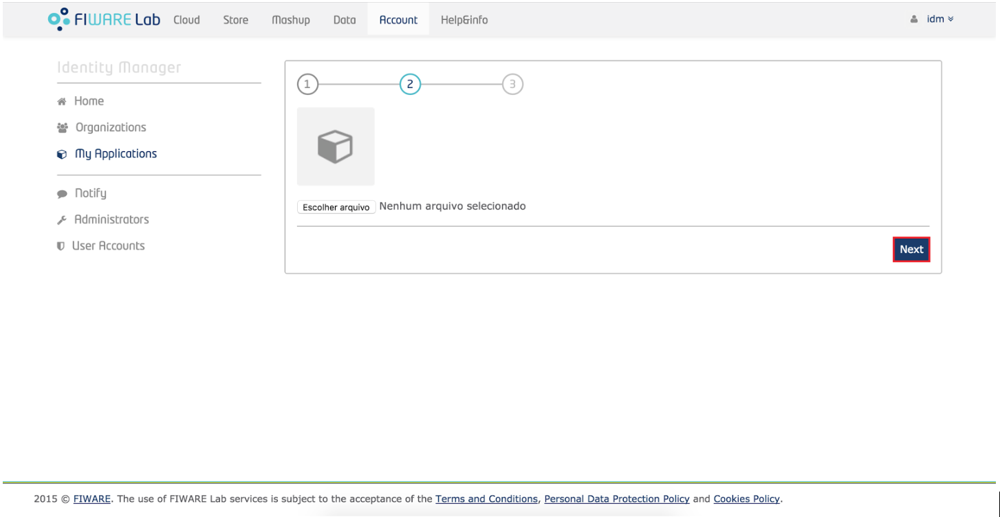

Preparando o Ambiente:
^^^^^^^^^^^^^^^^^^^^^^

Guia de Instalação
==================

Antes de colocar a infra em execução é necessário realizar algumas instalações:

- Para a instalação do docker siga o tutorial disponível em: `Instalação do Docker <https://www.digitalocean.com/community/tutorials/como-instalar-e-usar-o-docker-no-ubuntu-16-04-pt>`_

- Para instalação do docker-compose siga o tutorial disponível em: `Instalação do docker-compose <https://www.digitalocean.com/community/tutorials/how-to-install-docker-compose-on-ubuntu-16-04>`_

- Para instalação do docker-machine siga o tutorial disponível em: `Instalação do docker-machine <https://www.digitalocean.com/community/tutorials/how-to-provision-and-manage-remote-docker-hosts-with-docker-machine-on-ubuntu-16-04>`_

Após a instalação é necessário fazer clone ou download deste repositório:

- Faça clone do seguinte repositório: `keyrock-tutorial <https://github.com/FIoT-Client/keyrock-tutorial>`_

Guia de Configuração
====================

Após efetuar os passos da instalação é necessário configurar o ambiente para que possamos executar a infraestrutura necessária.

- No arquivo keyrock-tutorial/keyrock/files/local_settings.py altere o valor do atributo na linha 629, onde consta.::
	
	ACCESS_CONTROL_URL = 'localhost:8080'

- Para o IP da máquina que a infra será executada, tendo então.::
	
	ACCESS_CONTROL_URL = 'IP-MÁQUINA:8080'

- Após efetuar os passos para criação de uma aplicação, disponível em keyrock-tutorial/security-tutorial será necessário configurar o arquivo config.js disponível em keyrock-tutorial/fiware-pep-proxy/files/ modificando as linhas.::

	config.app_host = 'IP-APP';
	config.username = 'ID-PEPPROXY-FIWARE';
	config.password = 'SENHA-PEPPROXY';

Guia de Execução
================

Após efetuar os passos de Instalação e Configuração, para executar a infraestrutura é necesário:

- Acessar a pasta keyrock-tutorial/security-components e efetuar o seguinte comando.::
	
	sudo docker-compose build

- Logo após o término dessa execução é necessário efetuar.::

	sudo docker-compose up

Guia de Criação
================

- Para prosseguir com esse tutorial é necessário ter executado o tutorial anterior, acessar o endereço do <IP-Máquina>:8000 e acessar a interface do keyrock. Para acessar a interface de administrador acesse com usuário: idm e senha: idm.
 
- Ao entrar na conta de administrador cadastre uma nova aplicação seguindo as instruções abaixo:
 
- Para registrar uma aplicação clique no botão "register" como mostra a figura abaixo: 
.. image:: imagens/registro-app.png
- Então siga os três passos para concluir o registro, inicialmente cadastre o nome da aplicação, sua descrição, a url da aplicação e a url de redirecionamento onde o token de usuário será enviado.
.. image:: imagens/info-registro.png
- Aperte em "next" e escolha uma imagem para a aplicação, essa imagem é opcional

- Por fim, identifique a política de acesso para a sua aplicação, você poderá criar novas permissões e papéis através dessa interface.
.. image:: imagens/developer-portal.png    
- Após o término da configuração teremos essa página:
.. image:: imagens/infos-cadastradas.png
Onde as informações de client secret serão usuadas na sua aplicação. Na mesma página gere um PEP-Proxy, e use suas credenciais na sua aplicação também, essas informações devem ser editadas no guia de configuração.

